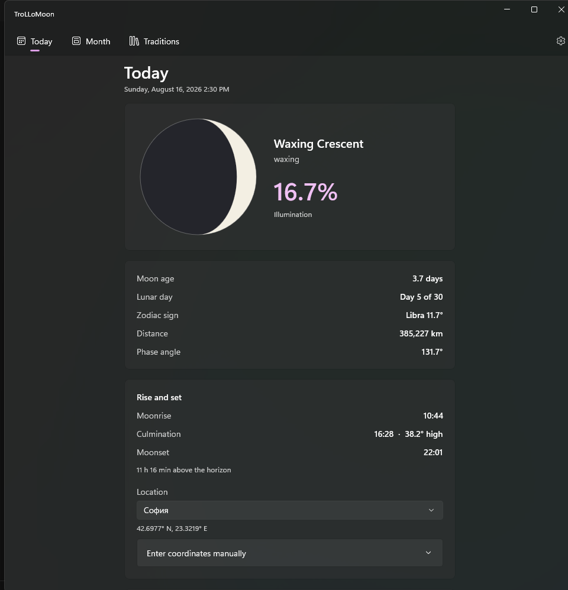
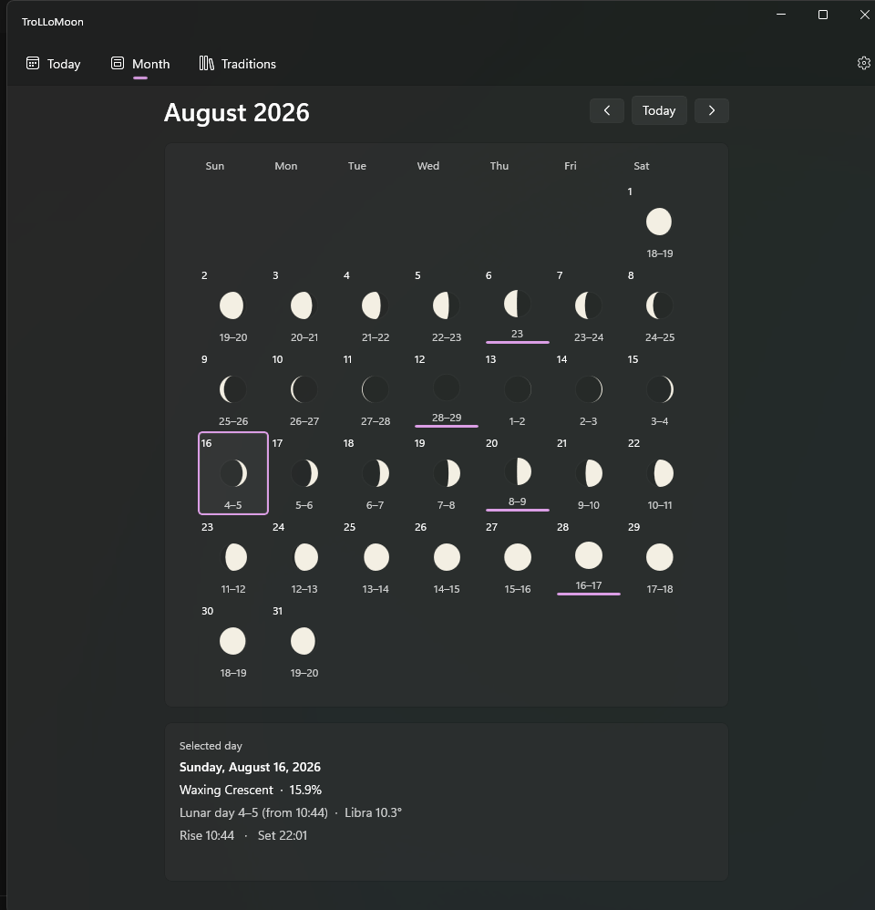
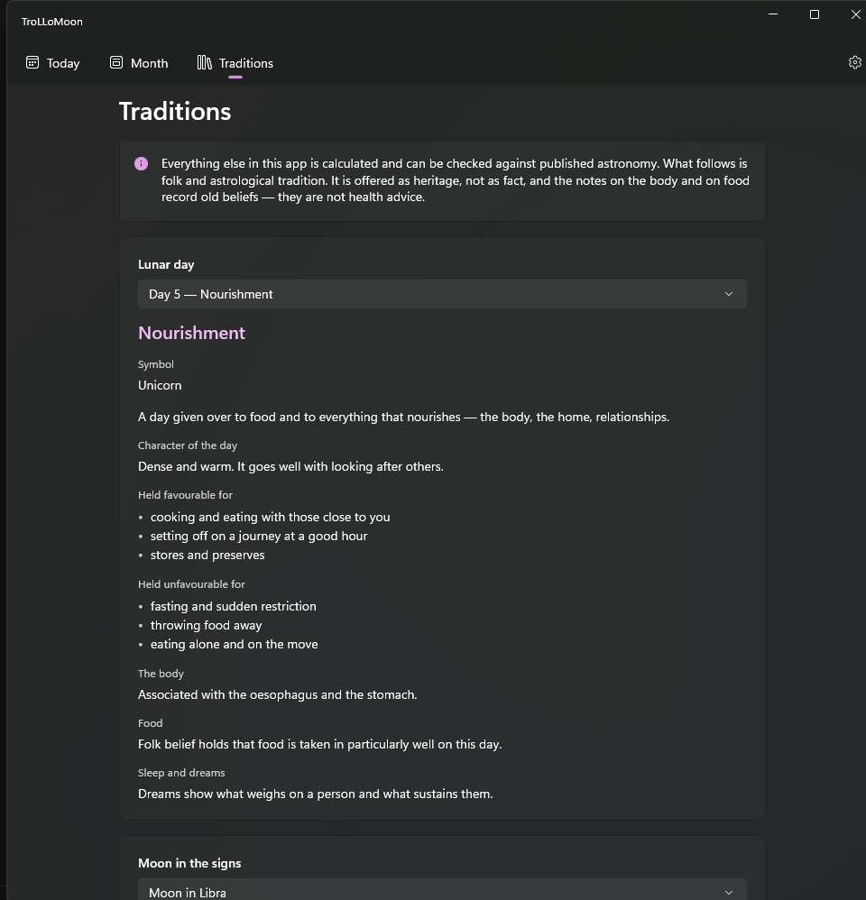
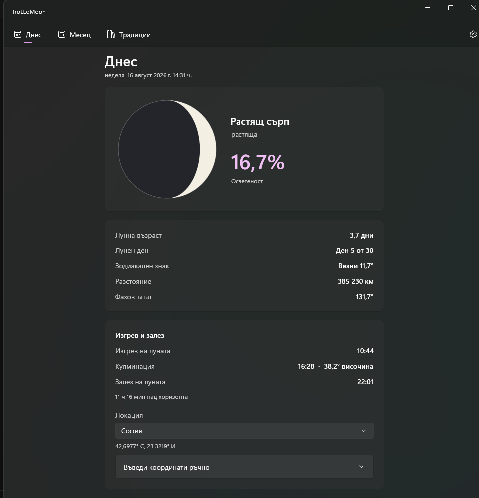

# 🌙 TroLLoMoon

**A detailed, beautiful and genuinely useful moon calendar for Windows 11.**

Free, open source, and fully offline. No accounts, no API keys, not a single network
request — every number you see is computed on your own machine.


<p align="center">
  
</p>

---

## What it does

### Today

The current state of the Moon, at a glance.

- A **real Moon disc**, drawn on the GPU with Win2D from the actual illuminated fraction —
  not a stock image, and not a rough approximation. The terminator is a proper ellipse.
- Phase name, whether the Moon is waxing or waning, illumination in percent
- Moon age, lunar day, zodiac sign with degrees into the sign, distance, phase angle
- **Moonrise, culmination and moonset** for your location, the altitude the Moon reaches at
  culmination, and how long it stays above the horizon
- The next new moon, first quarter, full moon and last quarter, with exact times

### Month

<p align="center">
  
</p>

A month at a time, with a small Moon disc drawn for every day, the lunar day and the moment
it changes, and an accent bar marking the days a principal phase falls on. Select any day
for its details.

### Traditions

<p align="center">
  
</p>

Descriptions of all 30 lunar days and of the Moon in each of the 12 signs — symbol,
character of the day, what tradition holds favourable and unfavourable, and notes on the
body, food and dreams.

> **This part is not astronomy, and the app says so.** Everything else in TroLLoMoon is
> calculated and can be checked against published sources. These texts are folk and
> astrological tradition, presented as heritage rather than fact. The notes on the body and
> on food record old beliefs; they are not health advice.

### Two languages

Bulgarian and English, switchable at runtime — including date formats, decimal separators
and thousands separators.

<p align="center">
  
</p>

---

## Design principles

These are constraints, not preferences:

| | |
|---|---|
| 🪟 **Windows 11 only** | No cross-platform code, no speculative abstractions |
| 🆓 **Free and open source** | No paid libraries, no paid or key-requiring APIs |
| ✈️ **Fully offline** | Zero network requests. No API keys, no accounts |
| 🎯 **Accuracy first** | The correctness of the numbers matters more than shipping features fast |
| 🎨 **Native Fluent look** | Mica, rounded corners, system accent colour, automatic light/dark |

The app requests exactly one capability: `runFullTrust`. No location, no network, no file
access.

---

## Accuracy

Accuracy is the point of this project, so it is worth being specific.

The astronomy is computed with [**AASharp**](https://github.com/jsauve/AASharp), a C# port
of PJ Naughter's AA+ library, which implements the algorithms from Jean Meeus,
*Astronomical Algorithms* (2nd ed.).

Using a good library is not the same as using it correctly. Two things that are easy to get
wrong, and that this project handles deliberately:

**Time scales.** Meeus's algorithms return results in **TT** (Terrestrial Time), not UTC.
The difference is currently about 69 seconds. Code that ignores it produces phase times
wrong by more than a minute. All time-scale conversion lives in a single file,
`Astronomy/TimeScales.cs`, and nothing else in the codebase converts between scales.

**Coordinate conventions.** Apparent vs. true coordinates, geocentric vs. topocentric
positions, and longitude sign conventions are not interchangeable. Each call into AASharp is
checked for which one it expects.

Where a simplification is made, the code carries a `// ТОЧНОСТ:` comment (Bulgarian for
"accuracy") explaining the trade-off and when it stops being acceptable.

### Three bugs found in the process

These were discovered empirically while building the app, verified against Meeus's worked
examples, and are covered by regression tests that will fail if the upstream behaviour
changes. All apply to **AASharp 2.12.1**.

**`AASMoon.EclipticLongitude` returns apparent longitude, not geometric.** The nutation in
longitude is already added inside. Meeus's example 47.a gives λ = 133.162655° before
nutation; AASharp returns 133.167264°, which is 16.59″ more — exactly the nutation for that
date. Adding it a second time "to make it apparent" throws the phase angle off by about 16″.

**`AASDynamicalTime.UTC2TT` stops using the leap-second table after about 2017.** Beyond
that it silently falls back to ΔT, which is a different quantity and, for current dates, a
forecast that reality has already diverged from. For 2026 it returns 73.1 s instead of
69.184 s — a ~4 second error in every computed phase moment, growing to 8 s by 2030.
TroLLoMoon computes the difference itself as `(TAI − UTC) + 32.184`.

**`AASRiseTransitSet2.CalculateMoon` counts parallax twice.** It applies a topocentric
correction to the coordinates *and* compares against the geocentric standard altitude
h₀ = +0.125° from Meeus chapter 15. Moonrise for Sofia on 16 August 2026:

| Formulation | Result |
|---|---|
| Topocentric, threshold −(0.5667° + s) — what TroLLoMoon uses | **10:44:29** |
| Geocentric, threshold +0.125° — classic Meeus ch. 15 | **10:44:29** |
| Geocentric, exact algebraic equivalent of the above | **10:44:29** |
| Topocentric, threshold +0.125° — double-counted | 10:50:00 |
| `AASRiseTransitSet2.CalculateMoon` | 10:49:45 |

Three algebraically equivalent formulations agree to the second. The library's own helper
matches the incorrect one, so TroLLoMoon implements moonrise and moonset itself.

### How it is verified

Four independent kinds of check, 294 tests in total:

1. **Against Meeus's worked examples** — the strongest, since the book is the source of the
   algorithms. Example 48.a (phase angle) agrees to **0.2 arcseconds**.
2. **Against an independently implemented algorithm** — the production code uses the
   periodic series from chapter 49; the test finds the same moments by root-finding on the
   positions from chapters 47 and 25. Different series, different coefficients. Maximum
   disagreement across 40 phase moments from 1977 to 2064: **13.7 seconds**.
3. **Against a published third-party calendar** — for August 2026.
   All four principal phases agree **to the minute**; the lunar days and zodiac positions
   match as well.
4. **Internal consistency** — bounds, monotonicity, synodic month length, the same instant
   giving the same answer regardless of time zone, and so on.

Reference values are hard-coded as constants so the test suite stays offline. **All of them
are stored in UTC**, stated explicitly at each one: published tables mix UT and TT, and
comparing them carelessly manufactures a ~69-second error that is not there. Bulgaria is
UTC+3 in August, not UTC+2 — a trap that costs an hour if missed.

| Date range | Tolerance for phase moments | Why |
|---|---|---|
| 1900 – 2025 | **< 30 seconds** | ΔT and leap seconds are measured, not predicted |
| 2026 onward | **< 2 minutes** | TAI − UTC for the future is an assumption |

Meeus's phase algorithm itself is good to roughly ±3–4 seconds for modern dates; the
tolerances above are dominated by the uncertainty in ΔT, not by the algorithm.

---

## Getting it

There are no published releases yet — build it yourself, or produce a package with the
commands below.

### Requirements

- [.NET SDK 9.0](https://dotnet.microsoft.com/download/dotnet/9.0) (pinned via `global.json`)
- Windows 11 SDK 26100
- Visual Studio 2022/2026, or Build Tools with the Windows App SDK components
- Windows App Runtime 1.8 (for the default, framework-dependent build)

### Build and run

```bash
# build everything
dotnet build TroLLoMoon.sln -c Debug

# build just the astronomy core — must succeed on its own, without WinUI
dotnet build src/TroLLoMoon.Core/TroLLoMoon.Core.csproj

# run the tests
dotnet test tests/TroLLoMoon.Core.Tests/TroLLoMoon.Core.Tests.csproj

# run the app
dotnet run --project src/TroLLoMoon.App/TroLLoMoon.App.csproj
```

The app builds unpackaged and framework-dependent by default, which keeps debugging simple.

> Note: `WindowsAppSDKSelfContained` combined with an unpackaged build crashes inside
> `Microsoft.UI.Xaml.dll` before managed code runs, unless `ProjectPriFileName` is set to
> `resources.pri`. Both are already configured correctly in the project file.

### Packaging

A portable, fully self-contained build — nothing needs to be installed on the target
machine:

```bash
dotnet publish src/TroLLoMoon.App/TroLLoMoon.App.csproj -c Release -r win-x64 --self-contained true -p:WindowsAppSDKSelfContained=true -o artifacts/selfcontained
```

A signed MSIX. `BuildMsix=true` switches the project from unpackaged to packaged; the
thumbprint must belong to a code-signing certificate in your own certificate store:

```bash
dotnet build src/TroLLoMoon.App/TroLLoMoon.App.csproj -c Release -r win-x64 -p:BuildMsix=true -p:GenerateAppxPackageOnBuild=true -p:AppxPackageSigningEnabled=true -p:PackageCertificateThumbprint=YOUR_THUMBPRINT -p:AppxBundle=Never -p:UapAppxPackageBuildMode=SideloadOnly
```

Installing a sideloaded MSIX requires its signing certificate to be trusted first — a
one-time step that needs administrator rights.

> ⛔ Never add `PublishSingleFile`, `PublishTrimmed`, or `PublishAot` to either command.
> See the licence note below.

---

## Architecture

```
TroLLoMoon.sln
├── src/
│   ├── TroLLoMoon.Core/        class library — no UI dependencies whatsoever
│   │   ├── Astronomy/          wrappers over AASharp, pure functions
│   │   ├── Models/             MoonSnapshot, MoonDay, MoonRiseSet, GeoLocation, ...
│   │   ├── Services/           IMoonCalculator, IMoonCalendar, ILocationProvider, ...
│   │   └── Lore/               traditional descriptions (JSON, embedded)
│   └── TroLLoMoon.App/         WinUI 3 — presentation only
│       ├── Views/  ViewModels/  Controls/  Services/  Strings/  Assets/
└── tests/
    └── TroLLoMoon.Core.Tests/  xUnit
```

Rules that are not bent:

- **`TroLLoMoon.Core` references nothing from WinUI or the Windows App SDK.** It builds and
  tests standalone. If that ever stops being true, the architecture has gone wrong.
- All calculations go through interfaces, so they can be substituted and mocked.
- Times are held in **UTC** internally (and Julian Day where AASharp wants it). Conversion to
  local time happens only at the UI boundary.
- No logic in code-behind; ViewModels do the work.
- No hard-coded strings in XAML.

### Location

Pick a city from the built-in list of Bulgarian regional centres, or type coordinates by
hand. The choice is remembered in `%LOCALAPPDATA%\TroLLoMoon\settings.json`.

TroLLoMoon deliberately does **not** use the Windows geolocation API: on desktop it resolves
position over WiFi or IP, which means a network request, and it requires an extra capability
in the app manifest.

*Known limitation: the built-in city names are Bulgarian only, so they stay in Bulgarian
when the interface is in English.*

---

## Licence

TroLLoMoon's own source code is **MIT** — see [LICENSE](LICENSE).

It links against **AASharp**, which is **LGPL-3.0**. AASharp is used as a dynamically linked
library and ships as a separate `AASharp.dll`, which is what keeps the combination
MIT-compatible.

> ⛔ **Do not enable `PublishSingleFile`, `PublishTrimmed`, or `PublishAot`.** Each of them
> merges or strips `AASharp.dll`, which counts as static linking under the LGPL and would
> force this entire project to be relicensed. They are pinned to `false` in
> `Directory.Build.props`.

The traditional descriptions in `Core/Lore/Content/` were written for this project. They are
not copied from any lunar-calendar website; the symbols of the lunar days are folk heritage,
but the wording is original and falls under the same MIT licence as the rest.

---

## Roadmap

Done: Today screen, monthly calendar, moonrise/moonset by location, moonrise-based lunar
days, tropical zodiac, traditional descriptions, Bulgarian and English.

Planned: eclipses, super- and micromoons, a gardening moon calendar (the elemental
fruit/root/flower/leaf division is already in place), and Bulgarian folk traditions by date.

---

## Credits

- **Jean Meeus**, *Astronomical Algorithms* (2nd ed.) — the algorithms behind everything here
- **PJ Naughter** — the AA+ library
- **[AASharp](https://github.com/jsauve/AASharp)** — the C# port this project builds on
